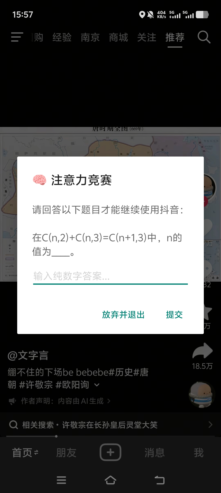
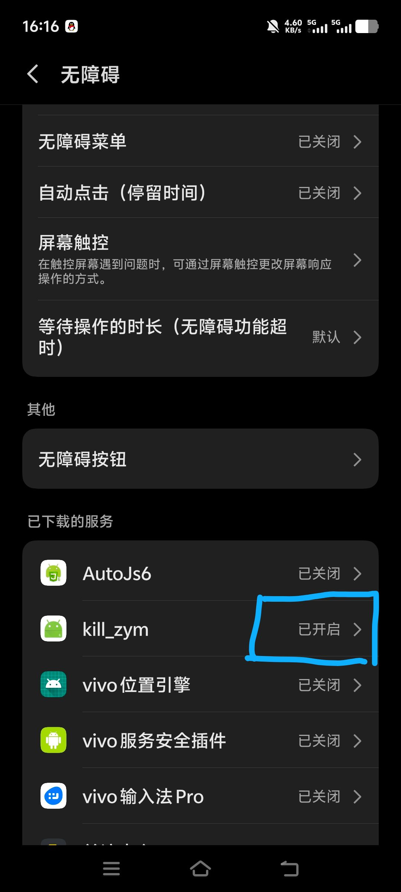
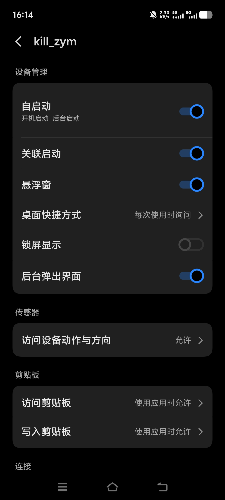
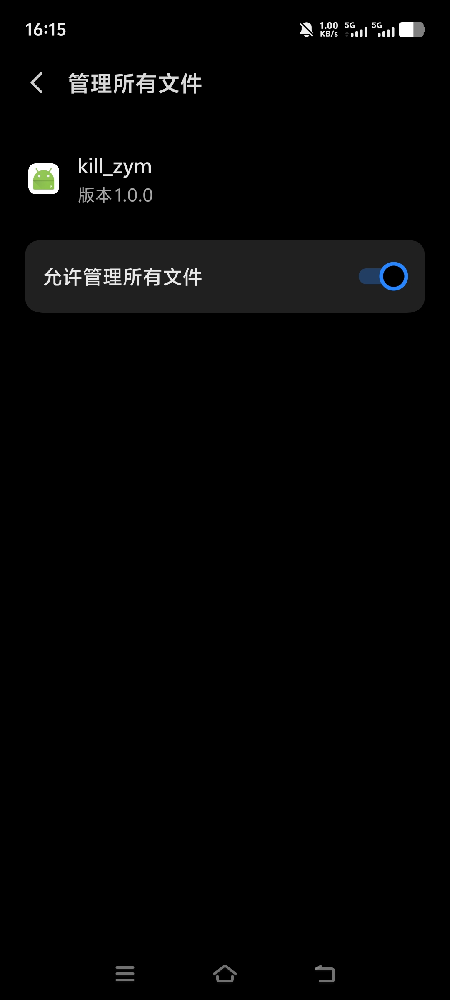

# 🧠 Attention-Guard (注意力守卫)

> 用魔法打败魔法：一款基于 AutoJs6 的安卓端“防沉迷”自动化拦截工具。
> 打开短视频 App？先做一道高中数学竞赛题再说。

## 📖 项目简介

在这个算法推荐无孔不入的时代，我们的注意力被无限切割。`Attention-Guard` 旨在通过**增加启动摩擦成本**，打破无意识解锁手机、刷短视频的习惯回路。

当用户尝试打开目标 App（如抖音、小红书）时，该工具会瞬间拦截并弹出一道随机数学题。**答对放行，答错或超时强制退回桌面**。

## ✨ 核心特性

- **强制验证**：随机抽取竞赛级数学题（纯数字答案），严格匹配才放行。
- **系统级防杀**：针对 OriginOS 6 / Android 14 深度适配，通过前台服务与电池白名单实现后台常驻。
- **APK 独立打包**：无需每次打开 AutoJs6，可打包为独立应用，伪装性强。
- **极简依赖**：单文件 JavaScript 编写，无复杂依赖，易于定制题库。

## 🛠️ 技术架构与系统博弈

- **语言/环境**：JavaScript (AutoJs6)
- **核心机制**：利用 `currentPackage()` 实时监听前台应用，结合 `dialogs` API 进行阻断式交互。
- **崩溃治理**：解决了 Android UI 线程内执行阻塞操作（`sleep`）导致的 `IllegalArgumentException` 崩溃问题。
- **系统保活**：利用前台服务、多任务卡片加锁、电池高耗电白名单，对抗 vivo OriginOS 严苛的杀后台机制。
- **应用联动**：利用系统级快捷指令（如蓝心小V）实现“打开抖音 -> 拉起守卫”的关联唤醒。

## 🚀 部署与使用

1. 在安卓手机上安装 [AutoJs6](https://github.com/SuperMonster003/AutoJs6)。
2. 导入 `main.js` 文件，修改 `TARGET_APP` 为你要拦截的应用包名（默认抖音为 `com.ss.android.ugc.aweme`）。
3. 在 AutoJs6 中点击“打包应用”，生成独立 APK。
4. 安装 APK 后，开启 **无障碍服务**、**悬浮窗权限** 以及 **“后台弹出界面”权限**
5. 将应用加入电池优化白名单，并在多任务界面下拉加锁。
6. 打开目标 App，开始你的做题之旅。

## 📸 运行效果

例如：

## 📝 定制题库

题库采用 `rawBank` 文本格式，内置百余道高中数学竞赛题（排列组合、概率论等）。你可以自由编辑，只需遵守 `题目内容。答案：纯数字` 的格式即可。

## 📄 License

This project is licensed under the MIT License.
